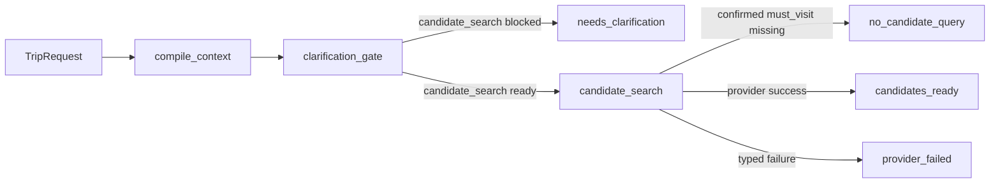

# EZ-007 最小 LangGraph 主链

EZ-007 把既有 `TripRequest`、`PlannerContext` 和 `TravelDataProvider` 接成第一条可执行旅行工作流。它验证 typed state、确定性条件路由、provider 来源和失败归责，不生成逐日行程，也没有加入模型 Agent。



## 节点职责

1. `compile_context` 调用确定性编译器，生成带输入哈希、预算语义、约束作用域和能力门禁的 `PlannerContext`。
2. `clarification_gate` 只检查 `candidate_search` 能力，而不是用一个全局布尔值停止所有工作。例如缺少预算会阻止预算校验，但不会阻止景点查询；缺少住宿房间数可以阻止最终定稿，但仍允许景点查询。
3. `candidate_search` 只处理已经确认的 `must_visit` 约束。它通过受限别名表把“故宫”映射到已捕获 fixture 使用的“故宫博物院”，然后调用 typed provider port。没有必去约束时明确返回 `no_candidate_query`，不会让模型或代码偷偷补充推荐。

每个节点追加一个版本化 `PlanningNodeEvent`。LangGraph reducer 合并事件，最终 `MinimalPlanningResult` 同时保存 `PlannerContext`、查询来源、候选、provider failure 和节点顺序。结果契约会拒绝跨城市候选、未知约束引用、重复候选，以及状态与事件不一致等冲突。

## 数据和错误边界

- 候选必须是 `CandidatePOI`，携带 provider、provider ID、live/fixture 模式、获取时间和原始响应哈希；
- provider timeout、限流、认证、空结果或字段问题不会被改写成模型推荐，而是保存为 typed `ProviderFailure`；
- 只捕获预期的 `ProviderRequestError`，编程错误仍会向上抛出；
- 当前 V1 依次查询已确认必去地点，尚未实现并行开放式召回、候选排序、天气/路线汇合或局部修复；
- 当前别名表只为已验证的北京 fixture 服务，不冒充通用景点知识库。

## 可观测性

工作流运行配置固定 `workflow_version`、request schema 版本、request ID、data mode 和节点 tags，不把 `raw_text` 放入 metadata。Graph state 仍包含完整 `TripRequest`，因此未来启用 LangSmith tracing 的调用方必须同时使用现有 `TraceRedactor`/Client anonymizer，不能把 metadata 安全误当成完整 trace 脱敏。默认 fixture CLI 显式关闭上传，保证 CI 和本地回放不访问网络。

## 离线运行与重放

```powershell
Set-Location backend
uv run python -m scripts.run_minimal_planning_graph
uv run python -m scripts.run_minimal_planning_graph --write-example
uv run pytest tests/test_minimal_planning_graph.py tests/test_domain_contract_examples.py --no-cov
```

默认命令输出脱敏摘要，不包含 raw provider payload。`--write-example` 机械更新 `docs/contracts/examples/minimal-planning-result.v1.json`，契约测试会重新运行 fixture Graph 并比较完整结果。

EZ-008 已冻结 10 条 standard/hard 旅行请求和 Graph 级确定性基线，见 [`docs/evaluation/planning-seed-baseline.md`](../evaluation/planning-seed-baseline.md)。下一增量才增加受 schema 约束的候选策略/比较 Agent；只有在固定 cases 中证明它比确定性必去查询带来可解释收益后，才扩展为多个专业 Agent。
