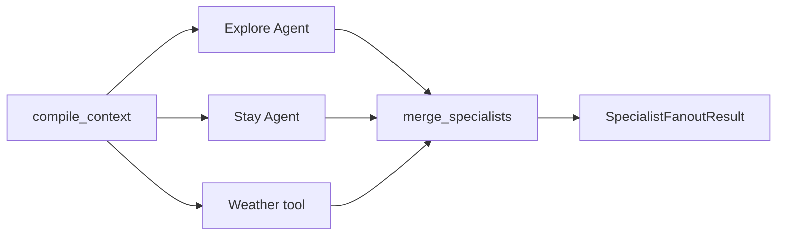

# Explore、Stay 与主动天气并行编排

EZ-204 把已验证的 Explore Agent、Stay Agent 和确定性天气工具接入一条独立 LangGraph fan-out/fan-in 工作流。该工作流输出的是供后续路线、预算和排程阶段消费的“专业信息包”，不是最终 `TripPlan`。



## 为什么天气不是第三个 LLM Agent

天气事实来自 Provider，风险阈值由确定性代码生成。额外让模型“判断要不要查天气”会增加成本和漏查风险，却不增加事实来源。因此天气是与两个 Agent 并行的零模型调用专业分支：只要 `PlannerContext` 的 `WEATHER_LOOKUP` 能力就绪，系统就主动调用工具，不要求用户补充“第二天下雨”。后续 Planner 可以使用风险调整活动，但不能把工具超时解释为“天气正常”。

## 状态合并与无覆盖

三个分支不能同时写一个 `recommendations` 字段。每个分支只追加一个 `SpecialistBranchResult`，LangGraph reducer 将更新累积为 tuple；merge 节点再按 `explore → stay → weather` 排序并要求恰好各一个。Pydantic 契约同时拒绝缺失、重复、乱序、跨请求结果和错误调用计数。

| 分支 | 模型责任 | 代码 / Provider 责任 | 输出 |
|---|---|---|---|
| Explore | 生成检索策略、在候选中排序 | 搜索、事实、来源、ID、证据校验 | `ExploreAgentResult` |
| Stay | 生成区域检索策略、在候选中排序 | 搜索、商业真实性边界、来源和证据校验 | `StayAgentResult` |
| Weather | 无 | 主动查询、确定性风险、来源 | `WeatherRisk[]` |

## 降级语义

每个分支独立返回 `succeeded`、`skipped` 或 `failed`：

- 能力缺失在依赖调用前返回 `skipped/capability_blocked`；例如缺少房间数只跳过 Stay，Explore 和 Weather 仍可完成。
- Provider 超时保留 `provider/timeout/retryable=true`，不暴露原始上游错误正文。
- Agent 协议错误与未知依赖错误使用不同类别，不能伪装成可重试 Provider 失败。
- 一个分支失败时，另外两个成功结果仍进入 `partial` 信息包；三个能力都被阻断时返回 `blocked` 且调用数为零。
- 已完成的模型响应 usage 会写入分支，即使后续 Provider 失败也能计入成本。

当前没有自动重试。类型化 `retryable` 是后续 retry policy 的输入，不代表系统已经执行重试。

## Checkpoint 边界

`SpecialistFanoutRuntime` 可用 `AsyncSqliteSaver` 持久化完整 JSON-compatible 结果。测试会关闭 runtime，用相同 `thread_id` 和 SQLite 文件重建，再注入“调用即失败”的模型与 Provider；恢复仍返回相同 checkpoint 和结果，外部调用为零。已有 thread 不能被重新 start。

这只证明“完整 fan-out 已提交后可读取且不重放”。它不证明进程在某个外部调用完成、分支提交前崩溃时的 exactly-once，也不代表 SQLite 已满足生产并发、高可用、加密或数据保留要求。

## 验证

```powershell
Set-Location backend
uv run pytest tests/test_specialist_fanout.py tests/test_specialist_fanout_eval.py --no-cov
uv run python -m scripts.run_specialist_fanout_eval
uv run python -m scripts.run_specialist_fanout_eval --live
```

离线套件验证真实并发进入、typed partial failure、无覆盖合并、能力跳过、错误脱敏、失败分支成本记录和 SQLite 恢复。`--live` 使用 DeepSeek 与 LangSmith，但 Provider 仍是显式 fixture，以隔离模型/编排回归；高德 live 合约由独立 probe 负责。
