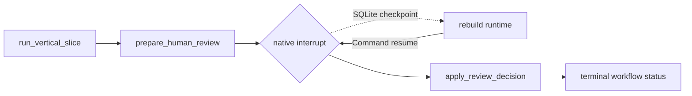

# Stateful checkpoint 与 HITL 主编排图

EZ-201 在现有北京三日 Gate 2 外增加了一层可恢复主编排。它没有新增景点、酒店、路线或天气能力；本阶段解决的是“规划完成后如何可靠暂停、由谁作决定，以及重建运行时后从哪里继续”。



## 状态与责任边界

| 环节 | 责任 | 会不会在恢复时重跑 |
|---|---|---|
| `run_vertical_slice` | 调 provider、Single Planner、组装草案、确定性校验 | 不会；结果已进入主检查点 |
| `prepare_human_review` | 根据校验结果生成 review ID、提示和允许动作 | 不会 |
| `human_review` | `interrupt()` 暂停，校验显式人工 resume | 节点会从头进入，但中断前无副作用；不会重跑规划 |
| `apply_review_decision` | 记录 reviewer、时间、comment 并映射工作流终态 | resume 后执行一次 |

内部候选搜索图和 Single Planner 图是主节点内的原子子步骤，并显式关闭 inherited checkpointer。这样持久化语义只有一层：要么纵向切片完整写入，要么该主节点失败，不会留下“模型已调用但内部半个状态可恢复”的模糊边界。

## 人审策略

| Validator 结果 | Review 类型 | 允许动作 | 禁止行为 |
|---|---|---|---|
| 可 finalizable 的草案 | `plan_approval` | `approve_draft` / `request_revision` / `cancel` | 不把审批解释为订票或最终计划 |
| 有硬冲突 | `conflict_resolution` | `acknowledge_conflict` / `request_revision` / `cancel` | 禁止 `approve_draft`，不静默放宽预算等约束 |

`approve_draft` 只产生工作流状态 `approved_draft`。原 `TripPlan.status` 仍是 `draft`，这是有意的真实性边界。

## 持久化与恢复

- 调用方为一次规划分配稳定且隔离的 `thread_id`；已有检查点的 ID 不能重新 start。
- 本地 runtime 使用 `AsyncSqliteSaver`。关闭第一个 context manager 后，用相同 SQLite 文件构建全新的 runtime，仍可读取暂停状态并 resume。
- 检查点载荷是 JSON-compatible 字典；每个节点入口使用 `StatefulPlanningData` 重新校验，降低 LangGraph 序列化升级风险。
- 错误 `review_id`、冲突场景中的批准动作和对终态再次 resume 都会在执行前被拒绝。
- checkpoint metadata 不写原始用户文本，但 SQLite state 本身保存完整结构化请求与规划结果。

## 可重放证据

版本化输入位于 `evals/cases/checkpoint-hitl/suite.v1.json`，报告位于 `evals/reports/stateful-checkpoint-hitl.v1.json`。当前固定结果为：

- 2/2 cases、20/20 checks；
- 2/2 在关闭并重建 runtime 后恢复出完全相同的暂停状态；
- 恢复后的 provider 调用 0 次、Planner model 调用 0 次；
- 正常草案进入 `approved_draft`，预算冲突只能进入 `conflict_acknowledged`；
- 两个案例的 `TripPlan` 都保持 `draft` 且内容未被 resume 静默修改。

```powershell
Set-Location backend
uv run python -m scripts.export_checkpoint_hitl_schemas
uv run python -m scripts.run_checkpoint_hitl_eval
uv run pytest tests/test_stateful_planning.py --no-cov
```

这些数字只证明固定 fixture 下的状态机、磁盘恢复、HITL 策略和无昂贵步骤重放。它们不代表实时数据、模型行程质量、生产恢复 SLA，也未覆盖前端审核界面、用户认证、进程强杀、并发 resume、分布式 worker、加密或保留期。
